  

  
  
  
  
  
  

  

  

  

  
  
  
  
  
  
  

  

  
  
  
  

  

  
  
  
  
  

  

  

  

Plain text version

**Himanshu Kumar** — AI Engineer at Britcore.ai · Founder, [OpenAgentHQ](https://github.com/OpenAgentHQ) · Open Source Contributor.
Building agentic systems, LLM infrastructure, and developer tools.

- **Focus:** agentic systems · LLM infrastructure · RAG · developer tooling
- **Stack:** Python, TypeScript, SQL · PyTorch, LangChain, LangGraph, Hugging Face, OpenAI, Anthropic, Ollama · FastAPI, Docker, Redis, ChromaDB, GitHub Actions
- **Portfolio:** [himanshu231204.vercel.app](https://himanshu231204.vercel.app) · **Email:** [himanshu231204@gmail.com](mailto:himanshu231204@gmail.com)

**Projects**

| Project | Description |
|---|---|
| [openagent-eval](https://github.com/OpenAgentHQ/openagent-eval) | RAG and agent evaluation framework — 18+ metrics, CLI and SDK |
| [modeldock](https://github.com/OpenAgentHQ/modeldock) | Local LLM model manager with pluggable runtime adapters |
| [run-git](https://github.com/himanshu231204/run-git) | PyPI-published CLI for common Git workflows |
| [mcp-web-search](https://github.com/himanshu231204/mcp-web-search) | Production MCP server for web search and page extraction |
| [linkedin-ai-comment-copilot](https://github.com/himanshu231204/linkedin-ai-comment-copilot) | Chrome extension using LangGraph multi-agent workflows |
| [ai-news-intelligence](https://github.com/himanshu231204/ai-news-intelligence) | Agent that monitors high-signal AI research |

**Open source contributions**

| Repository | Contributions |
|---|---|
| [langchain-ai/openwiki](https://github.com/langchain-ai/openwiki) | Connector features, error handling, workflow preservation |
| [OpenAgentHQ/openagent-eval](https://github.com/OpenAgentHQ/openagent-eval) | 13+ merged pull requests — review workflows, tests, releases |
| [OpenAgentHQ/modeldock](https://github.com/OpenAgentHQ/modeldock) | LM Studio runtime adapter, CI/CD fixes |
| [avenx-js](https://github.com/himanshu231204/avenx-js) | Compiler documentation |

**Technical writing**

| Repository | Description |
|---|---|
| [system-design-fundamentals](https://github.com/himanshu231204/system-design-fundamentals) | 16 runnable demos plus a RAG API across six scaling stages |
| [prompt-engineering-mastery](https://github.com/himanshu231204/prompt-engineering-mastery) | 7 modules — reasoning, RAG, security, evaluation |
| [PyTorch-Mastery](https://github.com/himanshu231204/PyTorch-Mastery) | Tensors and autograd through LLM fine-tuning |
| [ml-mastery](https://github.com/himanshu231204/ml-mastery) | Algorithms, notebooks, and reference guides |
| [dl-mastery](https://github.com/himanshu231204/dl-mastery) | Math-first deep learning, derivations to code |

<!--
  The terminal panels above are generated SVGs, not hand-edited.
  Edit the content in .github/scripts/build_terminal_svgs.py, then run:
      python3 .github/scripts/build_terminal_svgs.py
-->
